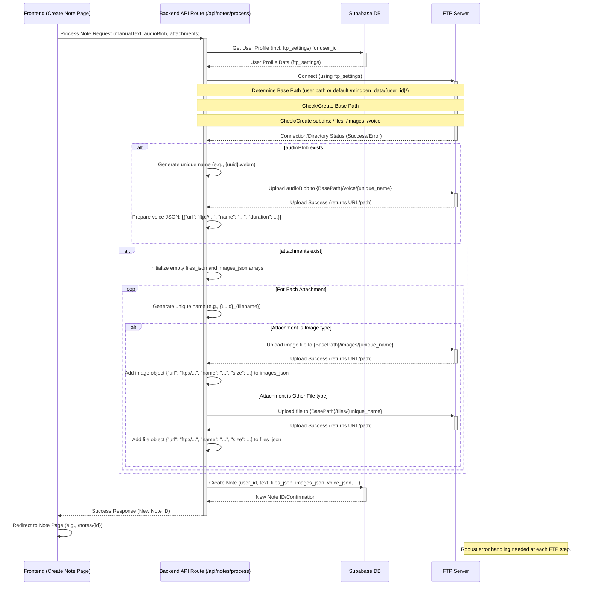

# Mindpen Storage Strategy

This document outlines the plan for storing user settings and note data within the Mindpen application, utilizing Supabase and FTP.

## 1. Settings Storage (`profiles` table)

User-specific settings will be stored in the `profiles` table in Supabase using dedicated JSONB columns:

*   **`ftp_settings` (JSONB):** Stores FTP connection details. Expected structure:
    ```json
    {
      "host": "ftp.example.com",
      "user": "username",
      "password": "password", // Consider encryption/secure handling
      "port": 21,
      "remote_path": "/optional/user/path", // Optional base path on FTP
      "use_passive": true // Recommended for most scenarios
    }
    ```
*   **`ai_settings` (JSONB):** Stores AI provider details (API keys, model preferences, etc.). The exact structure will be defined when implementing AI features.

**Note:** Profile data, billing, and voucher information are handled by existing columns/mechanisms.

## 2. Note Data Storage (`notes` table)

Individual notes will be stored in the `notes` table with the following structure for content:

*   **`user_id` (UUID):** Foreign key linking to the user profile.
*   **`text` (TEXT):** Stores the content entered in the manual text area.
*   **`transcripts` (TEXT):** Stores the transcription generated from audio recordings (populated by the transcription service).
*   **`files` (JSONB):** Stores an array of objects representing non-image/non-audio file attachments. Each object contains the FTP URL and original filename.
    *   Example: `[{"url": "ftp://.../files/uuid_doc.pdf", "name": "doc.pdf", "size": 12345}]`
*   **`images` (JSONB):** Stores an array of objects representing image attachments (uploaded or taken via camera). Each object contains the FTP URL and original filename.
    *   Example: `[{"url": "ftp://.../images/uuid_photo.jpg", "name": "photo.jpg", "size": 67890}]`
*   **`voice` (JSONB):** Stores an array of objects representing audio recordings. Each object contains the FTP URL and potentially a name or duration.
    *   Example: `[{"url": "ftp://.../voice/uuid_recording.webm", "name": "recording_1.webm", "duration": 30.5}]`
*   **(Other columns):** `id`, `created_at`, `title`, `summary`, etc. as needed.

## 3. FTP Server Interaction

*   **Protocol:** Plain FTP (not SFTP).
*   **Base Path:** The application will use the `remote_path` from `ftp_settings` if provided. If not, a default path like `/mindpen_data/{user_id}/` will be used.
*   **Directory Structure:** Within the determined base path, the application must ensure the existence of the following subdirectories, creating them if necessary before uploading:
    *   `/files/`
    *   `/images/`
    *   `/voice/`
*   **File Naming:** Files will be stored on the FTP server using unique names (e.g., incorporating UUIDs) to prevent collisions, while the original filename is preserved in the Supabase JSONB data.
*   **Error Handling:** Robust error handling is required for FTP connection, directory creation, and file uploads.

## 4. Implementation Plan

### 4.1. Backend API Endpoint (`/api/notes/process`)

This endpoint will handle the creation of a new note:

1.  Receive note data (manual text, audio blob, attachment files) from the frontend.
2.  Authenticate user and retrieve `user_id`.
3.  Fetch `ftp_settings` from the user's `profiles` record.
4.  Establish FTP connection.
5.  Determine base path and verify/create required subdirectories (`/files`, `/images`, `/voice`).
6.  Upload audio blob (if present) to `/voice`, get URL, prepare `voice` JSONB data.
7.  Upload attachments (if present) to `/files` or `/images` based on type, get URLs, prepare `files` and `images` JSONB data.
8.  **(Future)** Transcribe audio.
9.  **(Future)** Process with LLM.
10. Save note record to Supabase `notes` table with text and file/image/voice URLs.
11. **(Future)** Decrement user credits.
12. Return success (note ID) or error to frontend.

### 4.2. Backend API Endpoint (`/api/settings/test-ftp`)

This endpoint will test FTP connectivity:

1.  Receive FTP settings (host, user, pass, port, path, passive mode) from the frontend.
2.  Attempt to establish an FTP connection using the provided credentials.
3.  Attempt to list the contents of the specified `remote_path` (or the root if none provided) as a basic check.
4.  Disconnect from the FTP server.
5.  Return a success or error message (including specific error details if possible) to the frontend.

### 4.3. Frontend (`CreateNotePage`)

1.  Gather manual text, audio blob, and attachment `File` objects.
2.  Send data to `/api/notes/process` on "Process Note" click.
3.  Handle API response (redirect/error).
4.  Allow audio preview/delete before processing.

### 4.4. Frontend (`AccountPage` - Storage Settings)

1.  Provide input fields for FTP settings (`host`, `user`, `password`, `port`, `remote_path`, `use_passive` toggle).
2.  Implement a "Save Settings" button that updates the `ftp_settings` JSONB column in the user's `profiles` table via a dedicated API endpoint (e.g., `/api/settings/update`).
3.  Implement a "Test Connection" button that sends the *current* form values to the `/api/settings/test-ftp` endpoint and displays the success/error result to the user.

## 5. Data Flow Diagram



```mermaid
sequenceDiagram
    participant FE_Settings as Frontend (Account Page - Storage)
    participant API_Test as Backend API Route (/api/settings/test-ftp)
    participant FTPServer as FTP Server

    FE_Settings->>+API_Test: Test FTP Request (host, user, pass, port, path, passive)
    API_Test->>+FTPServer: Connect (using provided settings)
    FTPServer-->>-API_Test: Connection Status (Success/Error)
    alt Connection Success
        API_Test->>+FTPServer: List Directory (path or root)
        FTPServer-->>-API_Test: Directory Listing or Error
        API_Test->>+FTPServer: Disconnect
        FTPServer-->>-API_Test: Disconnect Status
        API_Test-->>-FE_Settings: Success Response ("Connection successful")
    else Connection Failure
        API_Test-->>-FE_Settings: Error Response ("Connection failed: [error details]")
    end
```

## 6. Security Considerations

*   **FTP Credentials:** Passwords should ideally not be stored in plain text. Consider options like encrypting the password within the JSONB or using a more secure storage mechanism if Supabase offers one (like Vault secrets, though this adds complexity). For now, we proceed with plain text storage as implied, but this is a security risk.
*   **FTP Traffic:** Standard FTP sends credentials and data unencrypted. This is insecure over public networks. Using FTPS (FTP over SSL/TLS) or SFTP (SSH File Transfer Protocol) would be significantly more secure, but the requirement is currently plain FTP.
*   **Permissions:** Ensure the FTP user configured has appropriate permissions (read, write, create directory) only within the designated user paths to prevent access to other parts of the server.
*   **Input Validation:** Validate all settings and file inputs on the backend to prevent injection attacks or unexpected behavior.