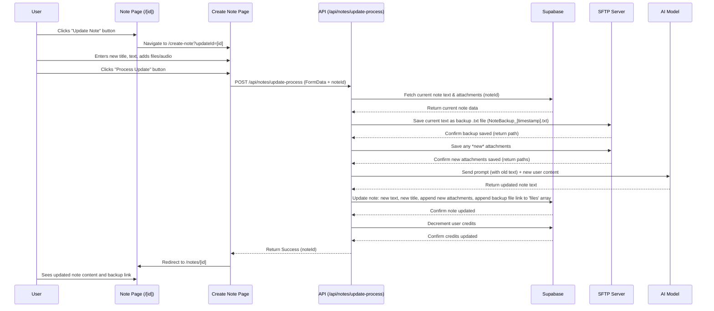

# Plan: Implement "Update Note" Feature

## I. Overall Goal

Enable users to update existing notes by adding new content (text, files, audio) which is then intelligently integrated into the original note by an AI model, while preserving a backup of the previous version.

## II. Key Components & Changes

1.  **Note Display Page (`src/app/notes/[id]/page.js`):**
    *   Add a new "Update Note" button visually similar and adjacent to the existing "Share" button.
    *   This button will navigate the user to the Create Note page, passing the current `noteId` as a query parameter (e.g., `/create-note?updateId=...`).

2.  **Create Note Page (`src/app/create-note/page.js`):**
    *   **Mode Detection:** Modify the page to check for the `updateId` query parameter on load.
    *   **Conditional UI:**
        *   If `updateId` is present (Update Mode):
            *   Change the main action button text from "Process Note" to "Process Update".
            *   Optionally, set the initial `noteTitle` state from the note being updated (though allow editing).
            *   The rest of the page (text area, attachment inputs) should remain empty, ready for the *new* content the user wants to add.
        *   If `updateId` is *not* present (Create Mode):
            *   The page functions as it currently does.
    *   **Conditional Logic:** Modify the `handleProcessNote` function (or create a dedicated `handleProcessUpdate` function) to:
        *   Check if in Update Mode.
        *   If yes, call a new backend API endpoint (`/api/notes/update-process`) instead of the current ones, passing the `updateId` along with the `FormData` containing the *new* content.
        *   On successful update, redirect the user back to the specific note page (`/notes/[updateId]`) instead of the general notes list (`/notes`).

3.  **New Backend API Endpoint (`/api/notes/update-process/route.js`):**
    *   This new route will handle the core update logic.
    *   **Input:** Expects `noteId` (the ID of the note to update) and `FormData` containing the *new* user inputs (title, manualText, attachments, voice recordings).
    *   **Steps:**
        1.  **Authentication & Authorization:** Verify the user is logged in and owns the note specified by `noteId`.
        2.  **Fetch Current Note:** Retrieve the current `text`, `title`, and attachment arrays (`files`, `images`, `voice`) for the given `noteId`. Handle cases where the note isn't found.
        3.  **Save Previous Version:**
            *   Generate a timestamp (e.g., `YYYYMMDD_HHMMSS`).
            *   Create a filename: `NoteBackup_[timestamp].txt`.
            *   Define a backup path on the SFTP server (e.g., `/note_backups/${userId}/${noteId}/${filename}`).
            *   Use the SFTP service (`sftp-service.js`) to save the *current* `text` content to this file path. If saving fails, return an error.
            *   Store the backup file's path and name for later.
        4.  **Process New Attachments:** Handle any *new* files/audio uploaded in the `FormData` (save them to SFTP, get their paths/metadata) similar to how `/api/notes/process` does. Keep track of these new attachment details.
        5.  **Prepare AI Payload:**
            *   Extract/transcribe the *new* user content (manual text, new audio, potentially image descriptions if that feature exists).
            *   Construct the specific system prompt provided in the request, injecting the *fetched current note text* into the `<current_note>` placeholder.
            *   Combine the system prompt and the *new* user content for the AI API call.
        6.  **Call AI Model:** Send the payload to the AI service. Handle potential AI errors.
        7.  **Process AI Response:** Extract the updated note content from the AI's response.
        8.  **Update Database:**
            *   Update the note record in the `notes` table where `id` matches `noteId`.
            *   Set the `text` field to the AI's response.
            *   Update the `title` if it was changed by the user on the Create Note page.
            *   Append the details of any *new* attachments (from step 4) to the respective `files`, `images`, `voice` arrays.
            *   Append the details of the *backup file* (from step 3) to the `files` array (e.g., `{ name: "NoteBackup_...", path: sftp_backup_path, type: 'backup', size: ... }`).
        9.  **Credit Deduction:** Decrement the user's `project_credits` in the `profiles` table.
        10. **Return Success:** Respond with a success message, potentially including the `noteId`.

4.  **SFTP Service (`src/lib/sftp-service.js`):**
    *   Ensure a function exists (or add one) that takes text content, a user ID, note ID, and filename, saves it to the designated backup location on the SFTP server, and returns the full path or confirms success. Needs robust error handling.

## III. Flow Diagram (Mermaid)

## IV. Notes

*   The backup file link will be added to the `files` array in the database.
*   A new API endpoint (`/api/notes/update-process/route.js`) will be created.
*   Backup filename format: `NoteBackup_[YYYYMMDD_HHMMSS].txt`.